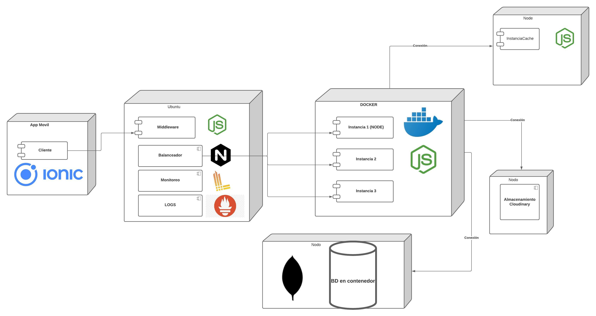

# Proyecto 1. Sistemas distribuidos

## Contenido
* [Arquitectura](#arquitectura)
* [Enunciado](#enunciado)
* [¿ Cómo usar este proyecto ?](#usar-este-proyecto)
  * [Construir el proyecto](#construir-el-proyecto) 
  * [Networking del proyecto](#network-proyecto)
* [Dependencias](#dependencias)
  * [Instancia](#dependencias-instancia) 
    * [NPM](#npm-instancia)
    * [Monitoreo Node Exporter](#monitoreo)
    * [Logging Promtail](#logging)
  * [Middleware](#dependencias-middleware)
    * [Balanceo de carga](#balanceo-de-carga)
    * [NPM](#npm-middleware) 
  * [Prometheus para monitoreo](#prometheus)
  * [Loki para Logging](#loki)
  * [Grafana gráficos](#grafana)
* [Desarrolladores](#desarrolladores)

## Arquitectura
A continuación se muestra la arquitectura "distribuida" del proyecto


## Enunciado
Implementar un sistema con balanceo de carga, almacenamiento a tres niveles(archivos, disco(BD) y memoria(cache-ram)),  registro de logging centralizado, monitoreo (de servicios) y tolerancia a fallos de instancias, donde se tenga un servidor middleware que redireccione las peticiones a minimo tres maquinas replica. Es decir que la aplicación tiene balanceo de carga con tres servidores de aplicaciones.

- La aplicación registra las personas que se van a vacunar donde se envia el nombre, la ubicación(cuidad), una foto de la cedula (la foto se debe guardar en un servidor de archivos externo). Los datos se deben guardar en una base de datos (puede ser centralizada, es decir todos los servidores se conecten a la misma BD) pero debe estar en una maquina aparte o contenedor.

- El sistema permite consultar un reporte en XLSX de los registros por cuidad (retorna la lista completa y el total).

- El sistema tiene servicio para mostrar un grafico del total de registros por cuidad, que usa cache que se actualiza con cada consulta al servicio de reporte.

Para el monitoreo:

Se debe tener un dashborad de monitoreo de los servicios.
Se debe tener un Logging centralizado que se pueda consultar.
Para la tolerancia a fallos se debe notificar cuando una maquina deje de responder enviando un email al administrador.

## Usar este proyecto
El uso de este proyecto se explica a continuación:

### Construir el proyecto
Correr el bash "init.sh" desde la carpeta raiz, usando:
```
bash init.sh
```
### Network proyecto
Basado en el networking que crea Docker, puedes testear los containers en:

- Loki:
  - http://172.17.0.8:3100
- Grafana:
  - http://172.17.0.7:3000
- Prometheus:
  - http://172.17.0.6:9090
- Instancia 3:
  - http://172.17.0.5:4000
- Instancia 2:
  - http://172.17.0.4:4000
- Instancia 1:
  - http://172.17.0.3:4000
- MongoDB:
  - http://172.17.0.2:27017

## Dependencias
Detalle de las dependencias del proyecto:
### Dependencias instancia
#### NPM Instancia
```
"cloudinary": "^1.25.0",
"express": "^4.17.1",
"fs": "0.0.1-security",
"mongodb": "^3.6.4",
"winston": "^3.3.3",
"xlsx": "^0.16.9"
```
#### Monitoreo
Se usa en los contenedores [Node Exporter](https://github.com/prometheus/node_exporter), y este apunta a **Prometheus**.
No es necesario instalarlo manualmente ya que la instancia realiza este procedimiento.

#### Logging
Para el logging de cada instancia se usa [Promtail](https://grafana.com/docs/loki/latest/clients/promtail/configuration/).
Promtail apunta a **Grafana/Loki**, el cual centraliza los loggins y los envia a **Grafana**
Tampoco es necesario instalarlo manualmente ya que la instancia realiza este procedimiento.

### Dependencias middleware
#### Balanceo de carga
Se uso **nginx** para el balanceo de carga, su configuración se puede ver en [nginx.conf](nginx.conf)

#### NPM Middleware
```
"axios": "^0.21.1",
"express": "^4.17.1",
"nodemon": "^2.0.7",
"redis": "^3.0.2",
"redis-server": "^1.2.2"
```

## Prometheus
Se usa [Prometheus](https://prometheus.io/) para centralizar el monitoreo, enviado por cada instancia, desde **Node_Exporter**, luego
estos se envian a **Grafana** para ser visualizados.

## Loki
[Loki/Grafana] se usa para centralizar todos los logs que generan las instancias, desde **Promtail**, luego estos se envian a **Grafana**
para ser visualizados desde el modulo "explorer" o en un panel.
Para mostarlos en Grafana, primero se debe configurar grafana para [añadir](https://grafana.com/docs/loki/latest/getting-started/grafana/) este "data source".

## Grafana
La plataforma [Grafana](https://grafana.com/) se usa para visualizar en gráficos y los logs de todo el sistema, es decir para centralizar logs y para generar gráficas de peticiones http o análisis de estadísticas generadas por las instancias.

## Desarrolladores
- [Mati Rodriguez](https://github.com/limarosa29)
- [Christian Chamorro](https://github.com/cris201497https://github.com/limarosa291130)
- [Oscar Rojas](https://github.com/augusticor)
